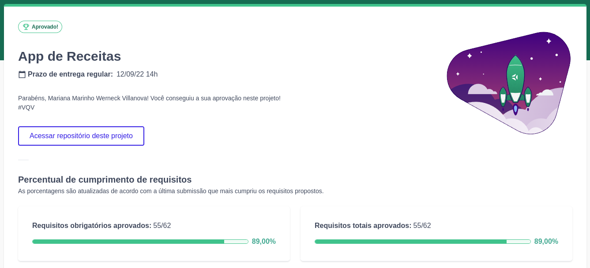
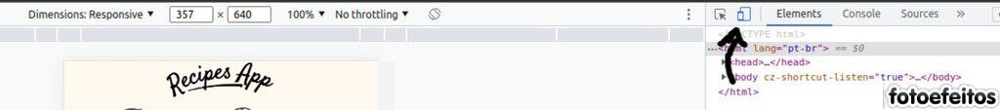
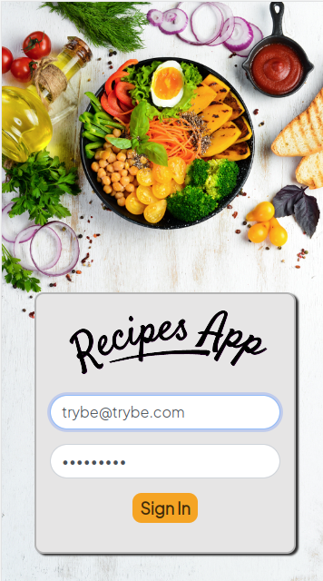
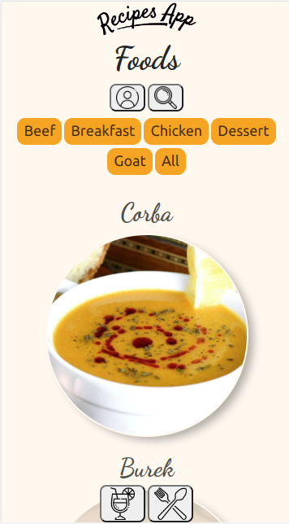
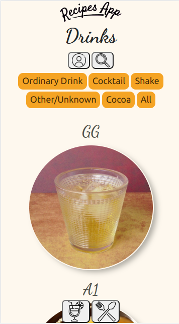

# Projeto App de Receitas!

Nesse projeto foi desenvolvido uma aplicação com foco em dispositivos móveis que retorna receitas de comidas e bebidas, utilizando duas API's: [TheCocktailDB](https://www.thecocktaildb.com/) e [TheMealDB](https://www.themealdb.com/). Essa aplicação foi desenvolvida utilizando React Hooks, RTL e Context API! No App de Receitas será possível: ver, buscar, filtrar, favoritar e acompanhar o progresso de preparação de receitas e drinks!

## Desempenho:

O projeto App de Receitas foi desenvolvido por [Mariana Werneck](https://www.linkedin.com/in/marinhomariana8/), [Heloísa Santana](https://www.linkedin.com/in/heloisa-santana-da-silva/), [Solon Amaral](https://www.linkedin.com/in/solon-amaral/), [Daniel Bahia](https://www.linkedin.com/in/danibahia/) e [Cássio Matsushita](https://www.linkedin.com/in/cassio-matsushita-217571a2/) durante o curso de Desenvolvimento Web na [Trybe](https://www.betrybe.com/)!

 
## Como utilizar:

Clone o repositório: <code> git@github.com:mariyzx/Recipes-App.git</code>.

Acesse a pasta do repositório clonado.

Rode o comando <code>npm install</code> para instalar as dependências do projeto e <code>npm start</code> para visualizar no navegador.

Utilize o inspecionar do navegador para redimensionar a tela para dispositivos móveis, mais precisamente 360 x 640.

## Preview:

## Connect:

 